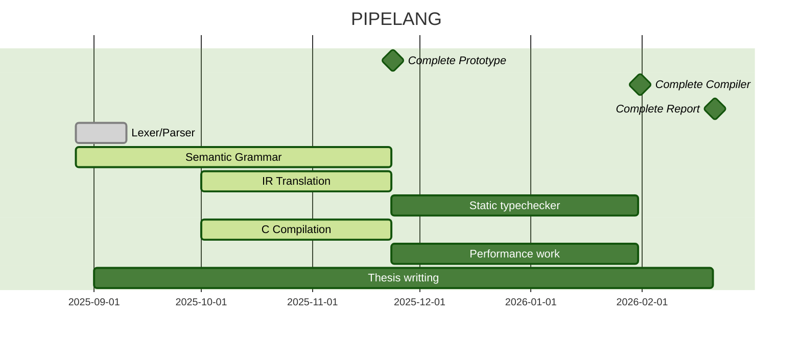

# Build
```console
    $ odin run .
```

```mermaid
---
config:
  theme: forest
---
gantt
    dateFormat  YYYY-MM-DD
    title       PIPELANG
    %% MILESTONES
    Complete Prototype: milestone,  prototype,      2025-11-23, 1d
    Complete Compiler:  milestone,  compiler,       2026-01-31, 1d
    Complete Report:    milestone,  report,         2026-02-21, 1d

    %% COMPILER TASKS
    Lexer/Parser        :done,      lexer-parser,   2025-08-27,2025-09-10
    Semantic Grammar    :active,    grammar,        2025-08-27,2025-11-23
    IR Translation      :active,    ir,             2025-10-01,2025-11-23
    Static typechecker  :           typechecker,    2025-11-23,2026-01-31
    C Compilation       :active,    c-compilation,  2025-10-01,2025-11-23
    Performance work    :           perf,           2025-11-23,2026-01-31

    %%
    Thesis writting     :active     report,         2025-09-01,2026-02-21
```
